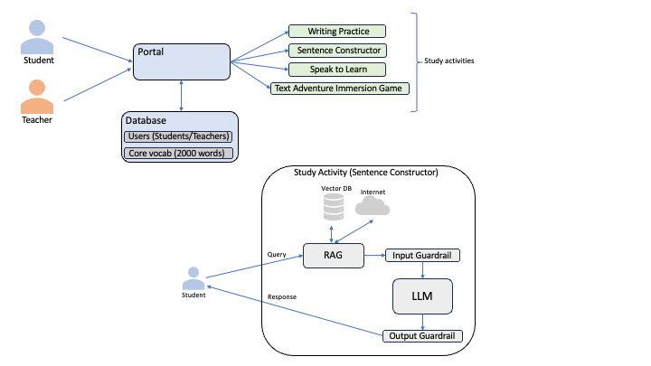

## Technical Considerations

### Conceptual

### Logical

a mid level diagram that describes the key technical components but not requiring detailed parameters so we can quickly rearchitect and communicate to our technical team the current workload

### Physical

a low level diagram that details all possible parameters and connections used by engineers/developers to accurately implement a solution (e.g. ARNs for resources, IP addresses, etc)

## Architectural/Design Considerations

### Requirements

Requirements are the specific needs or capabilities that the architecture must meet or support.

#### Business Requirements

- Customer Experience and Satisfaction

  - The application must provide an intuitive, responsive experience for the students
  - The application must improve the student's understanding of a foreign language (measure with various metrics, TBD)
  - The application must recieve positive feedback from the users (measure with various metrics, TBD)

#### Functional Requirements

Functional requirements are specific capabilities the system must have.

- User authentication and management

    The application must support various processes such as user authentication/login/forgot password etc.

- User interface and navigation

    The application must support a browser-based interface which shall be accessible via a computer or mobile device

#### Non-functional Requirements

These are additional requirements that the system must have that are not categorized as functional requirements.

- Security

    Within the region that the application is deployed, the application must comply with all local laws and regulations regarding data privacy and security

- Error handling and logging

    The application shall log all errors with timestamps, error codes and stack traces/diagnostic traces

#### Tooling

GenAI vs ML

### Risks

Risks are potential events or conditions that could negatively affect the success of the architecture or its implementation.

Identifying and mitigating risks ensures smoother project delivery.

### Assumptions

Assumptions are things considered to be true without proof at the time of planning and development.

These are necessary for decision-making but can introduce risks if proven false.

### Constraints

Constraints are limitations or restrictions that the architecture must operate within.

These are non-negotiable and must be adhered to during design and implementation.

### Data Strategy

Develop a comprehensive data strategy that addresses:

- Data collection and preparation
- Data quality and diversity
- Privacy and security concerns
- Integration with existing data systems

### Model Selection and Development

Select appropriate models based on your use case. Consider factors such as:

- Self Hosted vs SaaS
- Open weight vs Open Source
- Input-Output: text-to-text?
- Number of models needed
- Number of calls/model
- Size
- Evaluation
- Context window: input, output
- Fine-tuning requirements
- Model performance and efficiency

### Infrastructure Design

- Design a scalable and flexible infrastructure that can support GenAI workloads
- Leverage cloud platforms for scalability and access to specialized hardware
- Implement a modular architecture to allow for easy updates and replacements of components
- Consider hybrid or multi-cloud approaches for optimal performance and cost-efficiency
- Integration and Deployment
- Plan for seamless integration with existing systems and workflows:
- Develop APIs and interfaces for easy access to GenAI capabilities
- Implement CI/CD pipelines for model deployment and updates
- Ensure compatibility with legacy systems

### Monitoring and Optimization

- Establish robust monitoring and optimization processes:
- Implement logging and telemetry for model performance
- Set up feedback loops for continuous improvement
- Develop KPIs to measure the business impact of GenAI solutions
- Depending on the location, set up billing alerts to monitoring usage over time

### Governance and Security

- Implement strong governance and security measures:
- Develop policies for responsible AI use
- Implement access controls and data protection measures
- Ensure compliance with relevant regulations and industry standards

### Scalability and Future-Proofing

- Design the architecture with scalability and future advancements in mind:
- Use containerization and microservices for flexibility
- Implement version control for models and data
- Plan for potential increases in computational requirements

## Business Considerations

### Use Cases

- Start by clearly defining the specific use cases for GenAI within your organization:
- Identify the business problems you're trying to solve and the desired outcomes
- Complexity: As a stakeholder how do I understand the level of complexity integrating GenAI (specifically) LLMs into our workload?
    eg. How many moving parts will it add to our workload?
    eg. Is this set and forget, or do we need people to monitor and maintain these components regularly?
    Key levers of cost: As a stakeholder how can I understand the key costs to running GenAI at a glance?
        eg. Size of servers
        eg. Size of models
- Lock-in: What is a technical path we should consider so we are not locked-in to a vendor solution.
        eg. How do we avoid rug pulls? (The cost going up being locked into a solution)
        eg. How do we position our technical stack so we can transition to better models or solutions?
- What essential components should be conveyed as necessary when deploying a GenAI workload for production
- Guardrails
- Evaluations
- Sandboxing via Containers

### LLM specific thoughts

1- Choosing a Model:

- input-output modalities
- open source vs proprietary
- SaaS or self hosted
- context window
- cost

2- Enhance Context:

- Some options: Direct context injection or setting up a knowledge base?
- Some criteria to evaluate:
  - Size of input (one document or chunks of several docs)
  - Model context window
  - One time use or repeated use of information
  - Prototyping or scalable system?

3- Guardrails:

- Input guardrails
- Output guardrails
- Implementation

4- Abstract Model access

- Models & patterns to support
- Modalities to support

5- Caches

- Caching Strategy
- Cache levels
- Invalidation rules
- Storage options
- Hit rate optimization

6- Agents

- Actions to be executed
- System integration
